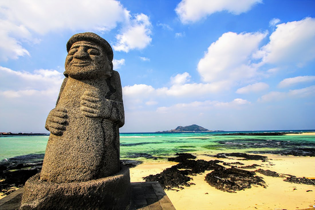

# University ML Camp Jeju 2019 (UMLC2019)

*"Let's get it into our society!*

**July 14 ~ August 3, 2019 (for 3 weeks at Jeju National University, Jeju, Korea)**  

*If you have interests in machine learning or deep learning, you should want to have a chance to implement non-trivial and decent applications for learning it deeply. Here is a good news. We invite you to join the 21-day long The 2nd University Machine Learning Camp in Jeju 2019(UMLC2019), where you can do what you want, and have a fun and unforgettable memory with your friends from all over the world.*

*For the period, we will design, implement, and train a deep learning model for a specific application using TensorFlow, Keras, PyTorch, etc. from start-to-finish with your mentor. We might have access to some mentors/experts to help you to implement your idea. We hope you get the benefit of this wonderful opportunity in Jeju, the most beautiful island in Korea.*

*All of you guys selected as attendees(mentors and mentees) **will be provided with rooms and meals during the camp** at Jeju National University. Round-trip airfare to Jeju Island (South Korea) will be covered fully for the mentors, and each mentee will be supported up to 500USD for flights. In addition to these benefits, participants will get valuable and practical experiences in the field of machine learning/deep learning. We look forward to your application!*
(Information regarding schedule, program, and benefits are subject to change.)

### Camp Overview

- Date: July 14 through August 3, 2019 (21 days, check-in date: July 13~14)
- Up to 20 mentees and some mentors
- Venue: Campus of Jeju National University, Jeju, South Korea 
- Host: Jeju National Univ.
- Supporter: Jeju Development Center, IIST (to be added more)
- Contacts: universitymlcampjeju@gmail.com

### Qualification

- Students from universities
- Undergraduate and graduate students 
- Some mentees from non-university organizations might be invited. 
- No nationality, gender, age, etc.
- **Must stay in Jeju National University from July 14 to August 3 (21 days).** 
- Weekday camp programs from 9:30 AM to 6 PM and excursion/party and free time over the weekend 
- Understanding of machine learning frameworks and the ability for implementation using programming languages (Python and etc.)
- Basic communication skills in English (All programs will be in English)
- **Clear personal project description on what they want to develop during the camp**
- Produce practical machine learning applications for the society and/or research results in the areas of Image classification, Chatbots, Auto Q&A, Spam detection, etc.
- **40% or more design/ implementation of your project should be done before joining the camp to complete it during the short camp period.**
- Project results will be open and shared. 

### Application 

- Your proposal for Asian University Machine Learning Camp Jeju 2019 Project
- **Please use the application form for Asian University ML Camp and describe information as in detail as possible.**
- CV that showcases your experiences about Machine Learning, Deep Learning, Python, TensorFlow, PyTorch, and etc.
- Other supporting materials to show your expertise as many as possible
- You can apply for the camp at the bottom of this web-page.

### Menor Recruitment

If you’re an expert in the field and interested in sharing your experiences and knowledge in the camp, please contact us at [universitymlcampjeju@gmail.com](mailto:universitymlcampjeju@gmail.com). You will serve as a personal mentor to 1-2 participants, holding 2-3 online/offline meetings a week to help them successfully complete their projects. While it is possible for you to provide online-only mentoring, you can visit Jeju Island to meet your mentees in person. We will provide round-trip airfare to Jeju Island and up to five (5) days of room and board.

### Organizing Committee

- Yungcheol Byun, Jeju National University, Korea
- Lap Nguyen Trung, Hoasen University, Vietnam
- Bobby D. Gerardo, West Visayas State University, Philippines
- Debnath Bhattacharyya, Vignan’s Institute of Information Technology, India
- Chan Yeob Yeun, Khalifa University, UAE
- Kiyota Hashimoto, Prince of Songkla University, Thailand
- Chi-Man Pun,  University of Macau, China
- Arslan Shaukat, National University of Sciences and Technology, Pakistan
- Jinho Kim, Jeju Free International City Development Center(JDC), Korea
- Eunsan Ko, Project 8, Korea
- Hojoon Lee, Paullab, Korea
- Junho Lee, J.AI Labs, Korea

### Hosted by

- Jeju National University
- Jeju Development Center (JDC) 
- Institute of Information Science & Technology
- Research Institute of Advanced Technology

### Camp Teams

- Around ten mentors: daily on/off-line meetings
- Around 20 attendees(mentees) from other countries
- A few numbers of speakers  

### Venue (Jeju National University, Jeju Island, Korea)

Located just off the coast of the Korean peninsula, Jeju Island is the largest volcanic island in Korea. Also known as Asia's Hawaii, the island is rife with beautiful sceneries and getaway resorts. Jeju boasts several natural treasures including Mount Halla, the country's highest peak, Trail Olle that winds around the rocky coastline, and Sunrise Peak, a dormant volcano ideal for catching sunrises and sunsets. You will be able to fully experience the island's charm for as long as a month stay without a visa. For more information, please visit: http://www.visitjeju.net/en/index.jto. 

### Timeline

- May 10: budget planning and reservations
- **May 31: Application due** 
- **June 7: Announcement of the candidate(s) of participants by mentors (checking the quality of project and possibility of implementation and review)**   
- June 9 - July 3: Preliminary activities at their locations (updating the application from the review)
- July 5: Evaluation and announcement of final attendees by committee 
- July 6-20: Mentee-mentor meeting(online) and 2-week pre-activity before joining
- **July 13, 14: Check-in** (Dormitory at Jeju National University, Jeju, Korea)
- **July 15: Camp starts** with the intensive implementation 
- July 24: Interim presentation
- **August 2: Final presentation**
- August 3: Check-out

### Camp Schedule

| Sunday                                                       | Monday                                                       | Tuesday                                                      | Wednesday                                                    | Thursday                                                     | Friday                                                       | Saturday                                                     |
| ------------------------------------------------------------ | ------------------------------------------------------------ | ------------------------------------------------------------ | ------------------------------------------------------------ | ------------------------------------------------------------ | ------------------------------------------------------------ | ------------------------------------------------------------ |
| 7/14                                                         | 7/15                                                         | 7/16                                                         | 7/17                                                         | 7/18                                                         | 7/19                                                         | 7/20                                                         |
| check-in   (dormitory)                                       | ***.9:30-11:00 Setting environment @ co-working place in dorm building #5***  .11:00-12pm, project activity   .12pm-1pm, lunch .1pm-4pm,  project activity ***.4pm-5pm. Opening and orientation @(TBA))*** .    .5pm-6pm, project activity .6pm-7pm dinner | .9:30am-10:00, Posting research memo (what I did yesterday & what to do today)   ***<u>.10:00-12pm, 5 min speech, self/project introduction @ coworking place</u>*** .12pm-1pm, lunch 1pm-6pm, project activity | *<u>**.9am-12:00, Camp Semina (Blockchain, AI and security @JDC)**</u>*  .12pm-1pm, lunch 1pm-6pm, project    .6pm-7pm, dinner | .9:30am-10:00, Posting research memo (what I did yesterday & what to do today)   .10:00-12pm, project   .12pm-1pm, lunch 1pm-6pm, project activity   .6pm-7pm, dinner | .9:30am-10:00, Posting research memo (what I did yesterday & what to do today)   .10:00-12pm, project   .12pm-1pm, lunch 1pm-6pm, project activity .6pm-7pm, dinner    .7pm-8pm, mentoring | .9:30am-10:00, Posting research memo (what I did yesterday & what to do today)   .10:00-12pm, project   .12pm-1pm, lunch . ***<u>1pm ~ Free time</u>*** |
| 7/21                                                         | 7/22                                                         | 7/23                                                         | 7/24                                                         | 7/25                                                         | 7/26                                                         | 7/27                                                         |
| ***<u>Excursion/party and getting   together(Seong-san-il-chul-bong, Wudo Island, Man-jang-gul Cave)</u>*** | 9:30am-10:00, Posting research memo (what I did yesterday & what to do today)   .10:00-12pm, project   .12pm-1pm, lunch 1pm-6pm, project activity   .6pm-7pm, dinner | 9:30am-10:00, Posting research memo (what I did yesterday & what to do today)   .10:00-12pm, project   .12pm-1pm, lunch 1pm-6pm, project activity   .6pm-7pm, dinner | 9:30am-10:00, Posting research memo (what I did yesterday & what to do today)   .10:00-12pm, project   .12pm-1pm, lunch 1pm-6pm, project activity   .6pm-7pm, dinner | 9:30am-10:00, Posting research memo (what I did yesterday & what to do today)   .10:00-12pm, project   .12pm-1pm, lunch 1pm-6pm, project activity   .6pm-7pm, dinner | 9:30am-10:00, Posting research memo (what I did yesterday & what to do today)   .10:00-12pm, project   .12pm-1pm, lunch 1pm-6pm, project activity   .6pm-7pm, dinner | .9:30am-10:00, Posting research memo (what I did yesterday & what to do today)   .10:00-12pm, project   .12pm-1pm, lunch . ***<u>1pm ~ Free time</u>*** |
| 7/28                                                         | 7/29                                                         | 7/30                                                         | 7/31                                                         | 8/1                                                          | 8/2                                                          | 8/3                                                          |
| ***<u>Excursion/party and getting   together(TBA)</u>***     | 9:30am-10:00, Posting research memo (what I did yesterday & what to do today)   .10:00-12pm, project   .12pm-1pm, lunch 1pm-6pm, project activity   .6pm-7pm, dinner | 9:30am-10:00, Posting research memo (what I did yesterday & what to do today)   .10:00-12pm, project   .12pm-1pm, lunch 1pm-6pm, project activity   .6pm-7pm, dinner | 9:30am-10:00, Posting research memo (what I did yesterday & what to do today)   .10:00-12pm, project   .12pm-1pm, lunch 1pm-6pm, project activity   .6pm-7pm, dinner | 9:30am-10:00, Posting research memo (what I did yesterday & what to do today)   .10:00-12pm, project   .12pm-1pm, lunch 1pm-6pm, project activity   .6pm-7pm, dinner | 9:30am-10:00, Posting research memo (what I did yesterday & what to do today)   .10:00-12pm, project   .12pm-1pm, lunch 1pm-6pm, project activity   .6pm-7pm, dinner | ***<u>.10:00-12pm, Final presentation    .12pm-2pm,   Pizza time and let’s share our feelings!, Check-out</u>*** |

### Benefits for students

- Having fun together!
- Enjoy Jeju Island during the summer season.
- Meet our friends from various universities from all over the world.
- Find the chance to enhance your skill in Deep Learning.
- Implement some practical applications/results using deep learning frameworks.
- **Stay in Jeju for 21 days (accommodation and meals are supported)** + various activities on weekends as you like
- **The flight fare will be covered for each mentee (up to 500USD).** 

### Co-Events

- Some special open seminar(TBA). 
- **Sharing knowledge with the guys from industries** 
- Visiting local places & having fun together

### Potential Collaborations with locals (subject to change)

- Meeting with ICT companies from Project *, JDC
- Invitation of students from Jeju National University
- Meeting with Jeju Science High/International school

### **Submit Your Application here!** 

* <u>**<a href="Application_Form_2019.docx" download>Click to download</a>**</u> an application form.
* Click on [here](http://duckduckgo.com) to submit your application. 